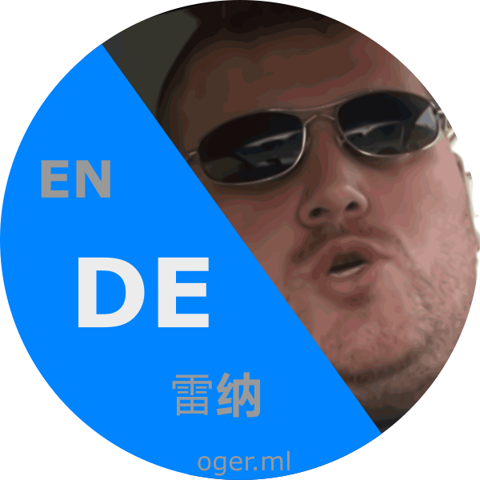

# Meddl loide unn a herdsliches wilkommne!

Ich bin der OgerBot und übersedse deinne scheiß in Meddlfrängisch, hätt ich gsachd!

Deutschsprachige Kurzbeschreibung: [@toOgerBot](https://t.me/toOgerBot) ist ein einfacher Telegram bot für inline Übersetzungen von Textnachrichten in's Meddlfrängische. Außerdem macht er gut ausgewählte Vorschläge für passende Audio-Nachrichten. ;-)

# Anleitung: 

1. Schreibe in einem beliebigen Telegram-Chat "@toOgerBot" (ohne Anführungszeichen) gefolgt von deiner Nachricht.
2. Wähle aus der aufpoppenden Auswahl entweder die Übersetzung (erster Eintrag) oder eine Audio-Nachrichten aus.
3. Der übersetzte Text bzw. die ausgewählte Audio-Nachricht wird unter deinem Namen "via @toOgerBot" gesendet.

# Wenn du Worschläge haschd, mach hier einne Bull Requeschd häd ich jeds gsacht: 
# [toOgerBot's GitHub Repository](https://github.com/OgerBot/toOgerBot)

